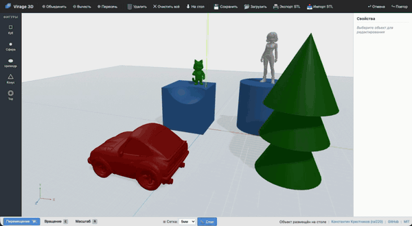

# Virage 3D Editor



3D-редактор для обучения детей (8–14 лет) основам 3D-моделирования с последующей 3D-печатью. Проект ориентирован на создание деталей для радиоуправляемых моделей (колёса, приводы, крепления).

Работает как **веб-приложение** прямо в браузере и как **десктопное приложение** для Windows, macOS и Linux.

**Лицензия:** MIT
**Автор:** Константин Крестников ([rai220](https://github.com/rai220))

> Открыл сайт — начал моделировать. Без регистрации, без установки.

### Веб-версия

**[Открыть редактор в браузере](https://rai220.github.io/virage_3d_editor/)**

### Десктопное приложение

Скачайте установщик для вашей платформы со страницы [Releases](https://github.com/Rai220/virage_3d_editor/releases):

| Платформа | Формат |
|-----------|--------|
| Windows | `.exe`, `.msi` |
| macOS (Apple Silicon) | `.dmg` (aarch64) |
| macOS (Intel) | `.dmg` (x86_64) |
| Linux | `.deb`, `.AppImage` |

> **macOS:** при первом запуске система может заблокировать приложение, так как оно не подписано. Чтобы открыть, выполните в терминале:
> ```bash
> xattr -cr "/Applications/Virage 3D Editor.app"
> ```
> Или: правый клик по приложению → «Открыть» → «Открыть» в диалоге.

### Демо

[](https://youtu.be/0JIB7wgi-40)

---

## Возможности

- **Примитивы** — куб, сфера, цилиндр, конус, тор
- **Булевы операции (CSG)** — объединение, вычитание, пересечение
- **Трансформации** — перемещение, вращение, масштабирование через гизмо
- **Панель свойств** — цвет, позиция, вращение, масштаб
- **Экспорт/импорт STL** — для 3D-печати
- **Сохранение/загрузка проектов** — в формате JSON
- **Undo/Redo** — отмена и повтор действий
- **Предустановленные виды камеры** — спереди, сзади, слева, справа, сверху, снизу
- **Навигация** — орбита, панорама, зум (мышь и тач)
- **Автосохранение** — сцена сохраняется в IndexedDB при каждом изменении

---

## Горячие клавиши

| Клавиша | Действие |
|---------|----------|
| `W` / `E` / `R` | Перемещение / Вращение / Масштаб |
| `Ctrl+Z` / `Ctrl+Shift+Z` | Отменить / Повторить |
| `Delete` / `Backspace` | Удалить выбранное |
| `Ctrl+D` | Дублировать |
| `F` | Фокус на выбранном |
| `Ctrl+S` | Сохранить проект |
| `Ctrl+E` | Экспорт STL |
| `1`–`6` | Виды камеры |
| `Escape` | Отмена текущей операции |

---

## Быстрый старт

```bash
git clone https://github.com/Rai220/virage_3d_editor.git
cd virage_3d_editor
npm install
npm run dev
```

Откройте **http://localhost:5173/** в браузере.

| Команда | Описание |
|---------|----------|
| `npm run dev` | Запуск dev-сервера |
| `npm run build` | Сборка веб-версии |
| `npm run tauri:dev` | Запуск десктопного приложения (нужен Rust) |
| `npm run tauri:build` | Сборка установщика (нужен Rust) |
| `npm run lint` | Проверка кода ESLint |

---

## Технологический стек

| Компонент | Технология |
|-----------|-----------|
| 3D-рендеринг | [Three.js](https://threejs.org) 0.170 |
| Булевы операции | [three-bvh-csg](https://github.com/gkjohnson/three-bvh-csg) 0.0.16 |
| Десктоп | [Tauri](https://tauri.app) v2 |
| UI | Vanilla JS + HTML/CSS (ES2020 modules) |

---

## Структура файлов

```
virage_3d_editor/
├── index.html              # Точка входа, layout, importmap
├── css/                    # Стили
├── js/
│   ├── app.js              # Инициализация, стартовая сцена
│   ├── editor/             # Editor.js (состояние), Viewport.js (рендеринг)
│   ├── tools/              # Примитивы, булевы операции, сохранение
│   ├── commands/           # Undo/redo (Command Pattern)
│   ├── export/             # STL экспорт/импорт
│   ├── ui/                 # Toolbar, панель свойств
│   └── i18n/               # Локализация (русский)
├── package.json
└── LICENSE
```

---

## Совместимость

Chrome 80+, Firefox 78+, Safari 14+, Edge 80+, мобильные браузеры.

**Требования:** WebGL2, ES2020 (modules), Import Maps.

---

## Лицензия

[MIT](LICENSE) © Константин Крестников ([rai220](https://github.com/rai220))
